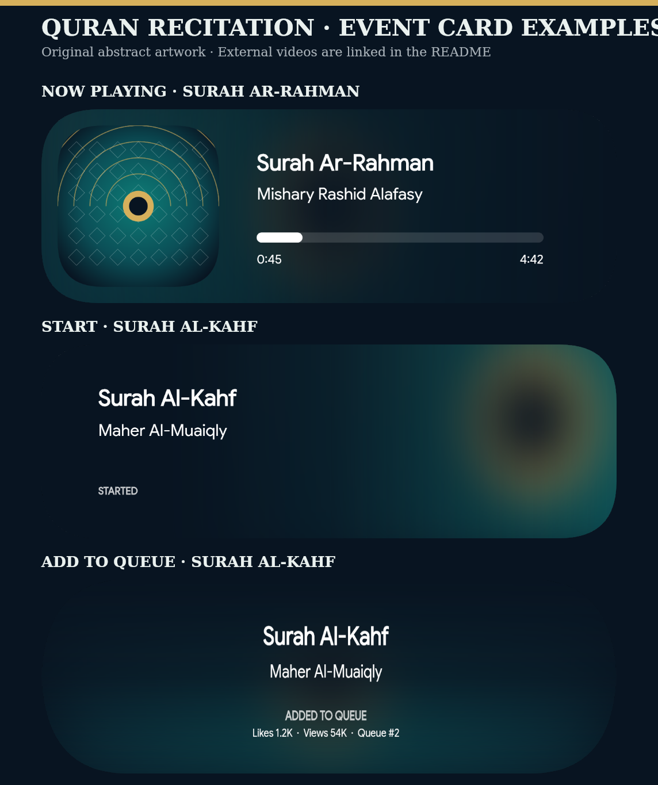

<div align="center">


# musicard

**A canvas-based Node.js library for generating polished, customizable audio cards.**

[](https://www.npmjs.com/package/musicard)
[](https://www.npmjs.com/package/musicard)
[](https://github.com/kunalkandepatil/musicard/blob/main/LICENSE)
[](https://github.com/kunalkandepatil/musicard)


</div>

## Installation

```bash
npm install musicard
```

## Quick start

`musicard` returns a `Buffer` that you can save locally, attach to a Discord message, or pass to another image workflow.

```js
import fs from "node:fs";
import { Bloom, initializeFonts } from "musicard";

async function main() {
  await initializeFonts();

  const card = await Bloom({
    trackName: "Blinding Lights",
    artistName: "The Weeknd",
    albumArt: "./album-art.png",
    fallbackArt: "./fallback-art.png",
    isExplicit: true,
    timeAdjust: { timeStart: "0:00", timeEnd: "2:54" },
    progressBar: 10,
    volumeBar: 70,
  });

  fs.writeFileSync("now-playing.png", card);
}

main().catch(console.error);
```

> Use a local file path or an image URL for `albumArt`. Provide `fallbackArt` when a resilient visual fallback matters to your workflow.

## Event cards

Every theme accepts an optional `type`. Omitting it, or using `"nowPlaying"`, preserves the existing card layout and remains fully backward compatible.

| `type`         | Purpose                       | Visible behavior                                                         |
| -------------- | ----------------------------- | ------------------------------------------------------------------------ |
| `"nowPlaying"` | Standard playback card        | Shows the existing time and progress layout. This is the default.        |
| `"start"`      | Playback has just begun       | Hides playback controls and shows a concise **STARTED** state.           |
| `"add"`        | An item has entered the queue | Hides playback controls and uses the available space for queue metadata. |

```js
const queuedCard = await Calm({
  type: "add",
  trackName: "A New Horizon",
  artistName: "Example Artist",
  albumArt: "./artwork.png",
  fallbackArt: "./artwork.png",
  likes: 1_200,
  views: 54_000,
  position: 2,
});
```

For `"add"` cards, `likes`, `views`, and `position` are optional. If no metadata is available, the card displays a neutral queue message. All three types are available in `Bloom`, `Calm`, `Drift`, `Ease`, `Haze`, and `Melt`.

## Quran recitation examples

The event-card API can also represent **recitation and other non-musical audio contexts**. The sample below demonstrates the three card states with a calm, original geometric artwork drawn locally by this repository. It does **not** embed, download, redistribute, or derive a thumbnail from the referenced videos.



Run the source-controlled example after building the project:

```bash
npm run build
node Examples/quran-recitation-demo.mjs
```

The external videos below are optional listening references. They are not bundled with `musicard`, and the rendered cards use only original local artwork.

| Card state in the demo | Attributed external reference                 | Theme             |
| ---------------------- | --------------------------------------------- | ----------------- |
| `"nowPlaying"`         | [Surah Ar-Rahman — Mishary Rashid Alafasy][1] | `Bloom`           |
| `"start"` and `"add"`  | [Surat Al-Kahf — Maher Al-Muaiqly][2]         | `Haze` and `Calm` |

Treat the recitations as religious content rather than music, retain the reciter’s attribution, and obtain any permission required for a use beyond linking to the original source. The queue figures in the generated `"add"` card are illustrative API data, not claimed YouTube statistics.

```js
const recitationCard = await Haze({
  type: "start",
  trackName: "Surah Al-Kahf",
  artistName: "Maher Al-Muaiqly",
  albumArt: "./original-artwork.png",
  fallbackArt: "./original-artwork.png",
});
```

## Themes

Choose a renderer that matches the tone of your application. Each theme supports the same event-card API.

| Theme   | Character                                                           |
| ------- | ------------------------------------------------------------------- |
| `Bloom` | Bright, balanced presentation for familiar now-playing experiences. |
| `Calm`  | Centered composition with a restrained, editorial feel.             |
| `Drift` | Artwork-forward layout with room for track identity.                |
| `Ease`  | Horizontal, information-dense structure.                            |
| `Haze`  | Soft, atmospheric presentation with strong text contrast.           |
| `Melt`  | Dark, immersive surface with expressive accent details.             |


## Customization

Use `backgroundColor` and `styleConfig` to tailor a card to your application without changing its core layout.

```js
const card = await Bloom({
  // Required card data…
  backgroundColor: "#FFFFFF",
  styleConfig: {
    trackStyle: {
      textColor: "#111111",
      textGlow: true,
      textItalic: true,
    },
    progressBarStyle: {
      barColor: "#000000",
      barColorDuo: true,
    },
  },
});
```

### Custom fonts

```js
import { registerFont } from "musicard";

registerFont("MyFont.ttf", "MyFont");
```

> Create a `Fonts` directory in your project root and place `.ttf` or `.otf` files there before registering them.

## More examples

### List available fonts

```js
import { GlobalFonts } from "musicard";

console.log(GlobalFonts);
```

### Send a card with discord.js

```js
return message.channel.send({
  files: [{ attachment: card }],
});
```

## Support

<a href="https://discord.gg/W8wTjESM3t"></a>

## References

[1]: https://www.youtube.com/watch?v=t5SZG6KEVFQ "Surah Ar-Rahman — Alafasy on YouTube"
[2]: https://www.youtube.com/watch?v=95mCqQ6OkQw "Surat Al-Kahf — Al Sheikh Maher Bin Hamad Al Muaiqly on YouTube"
